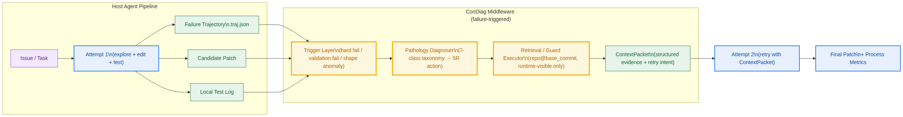
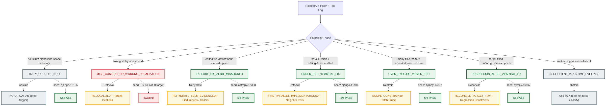

> **Document status.** This is an architecture draft aimed at academic advisors and as the
> starting point for a paper. It reflects the design state as of 2026-06-28, including the
> 5R framework, 7-class pathology taxonomy, and a v0 Manual Recovery Subsystem that passes
> 5/5 seed regression. The companion file `ConDiag_研究与实验全流程指导书_v0.1.md`
> covers operational / experimental workflow in more detail; this document focuses on
> architecture and contribution claims.

\newpage

# Abstract

LLM coding agents for repository-level program repair routinely fail even when the
information needed to recover is *already in the trajectory* — a stack trace points
at an uninspected source file, a viewed span is dropped before the final patch, or
a sibling implementation is edited while its parallel siblings are missed. We
present **ConDiag**, a decoupled failure-triggered context-recovery middleware
that sits between a Host Agent's failed attempt and its retry. ConDiag (i) detects
the failure mode from runtime-visible signals only (no gold leakage), (ii) maps
it onto a **5R × 7-class pathology taxonomy** (Relocalize / Retrieve / Rehydrate /
Restrain / Reconcile, plus NO-OP abstain), (iii) executes an executable retrieval
or guard plan against `repo@base_commit`, and (iv) hands the retry agent a
structured **ContextPacket** rather than a chunk list. The current v0 implements
four manual-seed recovery flows plus a NO-OP baseline, with 5/5 byte-identical
seed regression. We further propose **Pilot50**, a 50-instance ContextBench
evaluation that uses process-level metrics (file / block / line F1, Evidence
Drop, EditLoc recall) to validate the taxonomy, trigger thresholds, and the
ContextPacket mechanism against gold-annotated context.

# 1. Problem & Motivation

## 1.1 The Hidden Cost of "Just Retry"

When an LLM coding agent fails on a repository-level task, the trajectory almost
always already contains the signal needed to recover:

- A stack trace names the file and symbol the agent never inspected.
- A previously viewed span contains the exact lines the final patch needed.
- A failed test names a sibling path / parallel backend the agent missed.
- The agent edited the right file but ran zero local tests before submitting.

Today's coding agents handle this in one of two unprincipled ways:

1. **Naive retry** — re-roll the same agent with the same context, hoping the
   LLM samples a different exploration path. Cheap, blind.
2. **Bulk retrieval** — pre-load a BM25/embedding search over the whole repo,
   regardless of failure mode. Expensive, noisy, and often *increases* context
   without improving utilization.

Neither completes the explicit transformation **failure signal → context gap →
executable retrieval plan → concrete evidence → retry packet**.

## 1.2 Three Failure Shapes From Pilot Trajectories

An initial Pilot of five mini-SWE-agent runs on ContextBench-Verified surfaced
three repeating failure shapes, each requiring a *different* recovery action:

| Failure shape | Example | What is missing |
|---|---|---|
| **Wrong localization** | sympy-16597 | Agent edited the correct class but never inspected the actual error origin in the stack trace |
| **Seen but dropped** | astropy-13398 | Agent viewed the parallel registration site `@frame_transform_graph.transform`, but did not retain it when finalizing the patch |
| **Over-explore, over-edit** | sympy-13877 | 17 changed files, 4 repeated patterns, zero test runs |

A single "retrieve more context" action cannot address all three; the third
case actually requires *less* context and *pruning* the patch.

## 1.3 The Middleware Gap

What is missing is a **failure-triggered middleware** that is (a) decoupled from
the Host Agent so it can be retrofitted to mini-SWE, SWE-agent, Agentless or
AutoCodeRover without re-training, (b) pathology-aware so different failure
modes trigger different actions, and (c) bounded by a strict runtime/gold
separation so it cannot accidentally leak evaluation oracle into the agent's
view. ConDiag is designed to occupy exactly this gap.

# 2. Background & Related Work

**ContextBench** [1] provides 1,136 tasks across 66 repositories and 8
languages, each annotated with a human-verified gold context covering
**files, definition-level blocks, and lines**. Crucially it ships
*process-level* metrics — Incremental Context F1, Evidence Drop (the gap
between explored and utilized context), EditLoc recall — that let us measure
*what the agent looked at vs. what it ended up using*. SWE-bench Verified [2]
is outcome-only and answers none of these questions.

**Coding agents.** mini-SWE-agent and SWE-agent [3] are interactive shell
agents. Agentless [4] localizes via a system-prompt cascade without
retrieval. AutoCodeRover [5] does BM25 retrieval preemptively. RAG-style
SWE pipelines [6] pre-load retrieved chunks before the agent starts. All of
these are **preemptive** or **trigger-blind**; ConDiag is **post-failure and
pathology-aware**.

**Process-level diagnosis.** The ContextBench paper's Evidence Drop analysis
[1] directly motivates ConDiag's Rehydrate mechanism: agents frequently
*view* gold-relevant code but fail to retain it in the final patch context.

# 3. ConDiag Architecture



## 3.1 Position in the Pipeline

ConDiag is invoked after the Host Agent's Attempt 1 ends in a detectable
failure. Its outputs feed Attempt 2 of the same agent. The Host Agent's
prompt, tools, and model are untouched — ConDiag only controls the
*additional context* and *retry intent* that the agent receives between
attempts. This makes the middleware agent-agnostic.

## 3.2 5R Framework × 7-Class Pathology Taxonomy



ConDiag maps each diagnosed failure onto one of five recovery actions:

1. **Relocalize** — re-locate the edit target (stack-trace origin, error token).
2. **Retrieve** — surface unseen context (parallel implementations, neighbor tests, sibling classes).
3. **Rehydrate** — re-activate viewed-but-dropped evidence (viewed spans lost in the final patch).
4. **Restrain** — collapse over-wide edits (scope guard + patch prune).
5. **Reconcile** — coordinate the target fix with regression constraints.

Two classes (`LIKELY_CORRECT_NOOP`, `INSUFFICIENT_RUNTIME_EVIDENCE`) trigger
**abstain**: ConDiag explicitly declines to act rather than force-classify.

## 3.3 Oracle → Runtime Proxy Mapping *(key contribution)*

The Pilot-5 analysis initially used `file_cov`, `symbol_cov`, `EditLoc recall`
as trigger signals. **These are oracle metrics** — they require gold context to
compute and therefore cannot be used at runtime without leakage. Table 1
captures the systematic translation we performed so that every ConDiag rule
can be evaluated from runtime-visible facts alone.

**Table 1: Oracle → Runtime proxy mapping (excerpt)**

| Oracle metric (offline only) | Runtime-visible proxy (ConDiag input) |
|---|---|
| `file_cov < 0.3` | Long search history but issue-key symbol definition never viewed |
| `symbol_cov = 0` | Edited symbol disjoint from issue / stack / failed-test symbols |
| `EditLoc recall = 0` | Edited spans far from any high-value viewed span |
| `file_precision < 0.2` | Many edited files lacking independent failure evidence |
| `patch_files > 2×gold_files` | `changed_files ≥ K` + same lexical pattern across files |
| `line_cov low + precision high` | Local test still failing + unedited sibling in same file |

**Cheap and strong runtime signals** identified from case-bundle analysis:

- `test_runs_count == 0` → strong OVER_EXPLORE signal
- `git_checkout_count ≥ 2` → agent cycling, possible REGRESSION
- `viewed_to_edited_ratio > 0.7` → OVER_EXPLORE; `< 0.3` → MISS_CONTEXT
- `repeated_pattern_count ≥ 5` → PATTERN_OVER_GENERALIZATION

The Leakage Guard module (`leakage_guard.py`) enforces the runtime/gold
separation at the case-bundle schema level.

## 3.4 Three-Layer Trigger

ConDiag's entry-point trigger has three layers, applied in order:

- **Trigger-0 (hard failure)** — timeout, format error, patch-apply failure,
  empty patch, runtime exception. ConDiag short-circuits to a generic
  diagnostic.
- **Trigger-1 (runtime-visible validation failure)** — agent-ran tests
  failed *or* ConDiag's own runtime-visible local validation failed. Primary
  trigger. ConDiag runs "runtime-visible local validation", *never* the
  official FAIL_TO_PASS oracle.
- **Trigger-2 (patch-shape anomaly)** — Scope Guard score ≥ 2 (see §4.2).
  Risk trigger; enters audit / guard mode without claiming the patch is wrong.

## 3.5 v0 Module Architecture


The full module inventory is in Appendix A.

# 4. v0 Implementation Status

## 4.1 Manual Recovery Subsystem: 5/5 PASS


What 5/5 PASS *means*:

- Given a **human-authored** `manual_diagnosis.json` seed, ConDiag runs the
  appropriate retrieval or guard flow and produces a ContextPacket matching
  the locked baseline byte-for-byte.

What it does **not** mean (and we are explicit about this):

- It does **not** prove that an *auto*-diagnoser can produce the seed.
- It does **not** prove that Attempt 2 actually resolves the task — that is
  Agent-Retry v0 (post-Pilot50 milestone).
- It does **not** measure context-F1 against gold (that is ContextBench's job).

## 4.2 Scope Guard (RESTRAIN)

The Scope Guard scores each candidate patch on five binary signals:

```
scope_anomaly_score =
    1 if changed_files ≥ 5
  + 1 if changed_lines ≥ 200
  + 1 if api_calls ≥ 80
  + 1 if repeated_edit_pattern detected
  + 1 if many edited files lack support from issue / stack / failed tests / viewed evidence
```

Score ≥ 2 → warning; ≥ 3 → strong over-edit. The thresholds are seeded from
Pilot-5 and will be frozen after Pilot50.

## 4.3 Retrieval Executor

Eight operations, each other than `RECONCILE_*` is an executable repo probe
against `repo@base_commit`:

| Operation | Purpose |
|---|---|
| `FIND_SYMBOL_DEFINITION` | Resolve a short-name hint to a source location |
| `FIND_PARALLEL_IMPLEMENTATIONS` | Cross-file basename shape match + same-file sibling-class detector |
| `FIND_NEIGHBOR_TESTS` | Match failed-test concept to neighbor tests |
| `FIND_IMPORTS` | Locate import sites of an edited symbol |
| `FIND_CALLERS` | Locate call / decorator sites |
| `REHYDRATE_SEEN_EVIDENCE` | Re-attach viewed spans dropped from the final patch context |
| `READ_DEPENDENCY_NEIGHBORHOOD` | Read around an edited location |
| `FIND_FAILED_TEST` | Inspect a specific failing test's source |

`RECONCILE_TARGET_FIX_WITH_REGRESSION_CONSTRAINTS` is a *synthesis* action —
it produces no retrieval candidates of its own, only restructures the
ContextPacket to present both the target-fix evidence and the regression
constraints.

## 4.4 Leakage Guard

Every case-bundle and manual_diagnosis.json is split into two halves at the
schema level:

- **runtime_signals** — trajectory / patch / test-log derived facts. The only
  input to trigger, diagnoser, executor.
- **gold_check** — ContextBench metrics, gold patch shape, oracle pathology
  label. Marked `allowed_for_runtime: false`. Used only for offline analysis.

`leakage_guard.py` rejects any case-bundle whose runtime half overlaps the
gold half.

# 5. Pilot50 Evaluation Plan


## 5.1 Configuration

50 ContextBench-Verified instances drawn from the 500-instance Lite split,
stratified across pathology categories:

| Stratum | Count | Rationale |
|---|---:|---|
| Django error-code / system-check / validation | 20 | RELOCALIZE mining (models.E###, SystemCheckError) |
| Django config / database / router / exception | 10 | Localization pathology |
| Non-Django Python (sympy / transformers / astropy / sklearn) | 15 | Taxonomy diversity |
| Local easy / likely-correct controls | 5 | NO-OP false-positive test |

## 5.2 Three-Layer Analysis

1. **Auto triage (all 50).** Run ConDiag trigger + 5R scorer + RELOCALIZE
   miner → produce `pilot50_triage_matrix.csv`. Answer four questions: Does
   ConDiag over-trigger? Does the 5R dispatch make sense? Are NO-OP cases
   correctly skipped? Can RELOCALIZE candidates be surfaced?
2. **Manual diagnosis (top 6–10).** For each high-value case, author a
   `manual_diagnosis.json` and run the recovery flow. Goal: extend the
   4-flow seed set into 15–20 manual recovery fixtures.
3. **Agent-Retry v0 (final).** Pick 10 most-promising cases and re-run
   mini-SWE with ConDiag's ContextPacket. Compare resolved / regression /
   token cost / repair iterations against Attempt 1.

## 5.3 Metrics

**Primary (process-level, from ContextBench):**

- Incremental Context F1 at file / block / line granularity
- Evidence Recovery: ConDiag-retrieved evidence hits Attempt-1 missed gold
- Evidence Drop Recovery: re-activated viewed spans reduce Evidence Drop
- Retrieved Context Size / Token Cost
- NO-OP False-Positive Rate on likely-correct controls

**Secondary (outcome-level, for Agent-Retry v0):**

- Resolved rate (FAIL_TO_PASS / PASS_TO_PASS)
- Regression rate (newly broken PASS_TO_PASS)
- Token cost / repair iterations

## 5.4 Evaluation-Only Isolation

ContextBench gold metrics appear **only** in Stage 3 (offline evaluation)
and are physically unable to enter Stage 4 (ConDiag runtime triage) or
Stage 5 (Agent retry). The case-bundle parser
(`condiag/tools/build_case_bundle.py`) refuses to write any gold-derived
field into `runtime_signals.json`.

# 6. Roadmap

| Phase | Goal | Status |
|---|---|---|
| **P0** | NO-OP Gate (do no harm on success) | ✅ 5/5 seed PASS |
| **P1** | RELOCALIZE seed + flow | ⏳ Pending Pilot50 mining |
| **P2** | REHYDRATE + Scope Guard | ✅ 5/5 seed PASS |
| **P3** | Sibling / Parallel Audit (RETRIEVE) | ✅ 5/5 seed PASS |
| **P4** | REGRESSION_AFTER_PARTIAL_FIX (RECONCILE) | ✅ 5/5 seed PASS |
| **P5** | Auto-diagnoser (replace manual seed) | Post-Pilot50 |
| **P6** | Agent-Retry end-to-end resolved rate | Pilot50 Stage 5 |

# 7. Competitive Analysis

**Table 2: ConDiag vs. related systems**

| Property | ConDiag | Agentless | AutoCodeRover | RAG-SWE |
|---|---|---|---|---|
| Trigger | Post-failure | Preemptive | Preemptive | Preemptive |
| Retrieval granularity | Pathology-aware | None | BM25 chunks | Embedding chunks |
| Output form | Structured ContextPacket | Localization list | Bug-locations + snippets | Chunk list |
| Evaluation | Outcome + process | Outcome only | Outcome only | Outcome only |
| Integration | Decoupled middleware | Standalone | Standalone | Standalone |
| Pathology-awareness | 5R × 7 classes | None | None | None |

# 8. Open Questions & Risks

- **Auto-diagnoser is unbuilt.** All current seeds are human-authored. The
  risk is that pathology classification from runtime signals is too noisy
  without gold features. Pilot50 triage matrix will answer this.
- **RELOCALIZE seed is missing.** Pilot-5 had no pure RELOCALIZE case. If
  Pilot50 also fails to surface one, the 5R framework has a gap.
- **Recovery execution ≠ repair rate.** Passing seed regression proves
  ConDiag can produce the intended ContextPacket. Whether Attempt 2 actually
  resolves more tasks is Agent-Retry v0 — currently unbuilt.
- **Scale.** 50 instances may be too few to freeze trigger thresholds. We
  may need to extend to 100+ before publishing.

\newpage

# Appendix A: Module Inventory

22 modules under `~/condiag/condiag/`, grouped per Figure 3:

**Core / Schema.** `schemas.py`, `loader.py`, `leakage_guard.py`.

**Trigger & Diagnose.** `trigger.py`, `scope_guard.py`, `diagnosis_normalizer.py`,
`action_planner.py`.

**Retrieval flow.** `repo_resolver.py`, `repository_index.py`,
`retrieval_executor.py`, `evidence_selector.py`, `manual_retrieval.py`.

**Guard flow.** `patch_scope_analyzer.py`, `edit_support_checker.py`,
`scope_guard_executor.py`, `patch_prune_suggester.py`, `manual_guard.py`.

**Output / Reporting.** `context_packet_builder.py`, `report.py`, `cli.py`,
`seed_regression.py`.

**Tools (under `condiag/tools/`).** `build_case_bundle.py`,
`find_relocalize_candidates.py`, `parsers/{base,common,miniswe}.py`.

# Appendix B: 5R Action Verbs

- **Relocalize.** `TRACE_ERROR_ORIGIN`, `FIND_SYMBOL_DEFINITION`,
  `RERANK_LOCATIONS`.
- **Retrieve.** `FIND_PARALLEL_IMPLEMENTATIONS`, `FIND_NEIGHBOR_TESTS`,
  `FIND_IMPORTS`, `FIND_CALLERS`, `READ_DEPENDENCY_NEIGHBORHOOD`,
  `FIND_FAILED_TEST`.
- **Rehydrate.** `REHYDRATE_SEEN_EVIDENCE`.
- **Restrain.** `SCOPE_CONSTRAIN`, `PATCH_PRUNE_CANDIDATES`,
  `RUN_RUNTIME_VISIBLE_VALIDATION`.
- **Reconcile.** `RECONCILE_TARGET_FIX_WITH_REGRESSION_CONSTRAINTS`.

# Appendix C: References

1. ContextBench: A Process-Level Benchmark for Context Engineering in
   Repository-Level Program Repair (2026).
2. SWE-Bench Verified (`princeton-nlp/SWE-Bench_Verified`), 500-instance Lite
   split.
3. Yang et al., SWE-agent: Agent Computer Interfaces Enable Software
   Engineering Language Models (2024).
4. Xia et al., Agentless: Demystifying LLM-based Software Engineering Agents
   (2024).
5. Zhang et al., AutoCodeRover: Autonomous Program Improvement (2024).
6. RAG-SWE retrieval-augmented SWE pipeline variants (various, 2024–2025).
