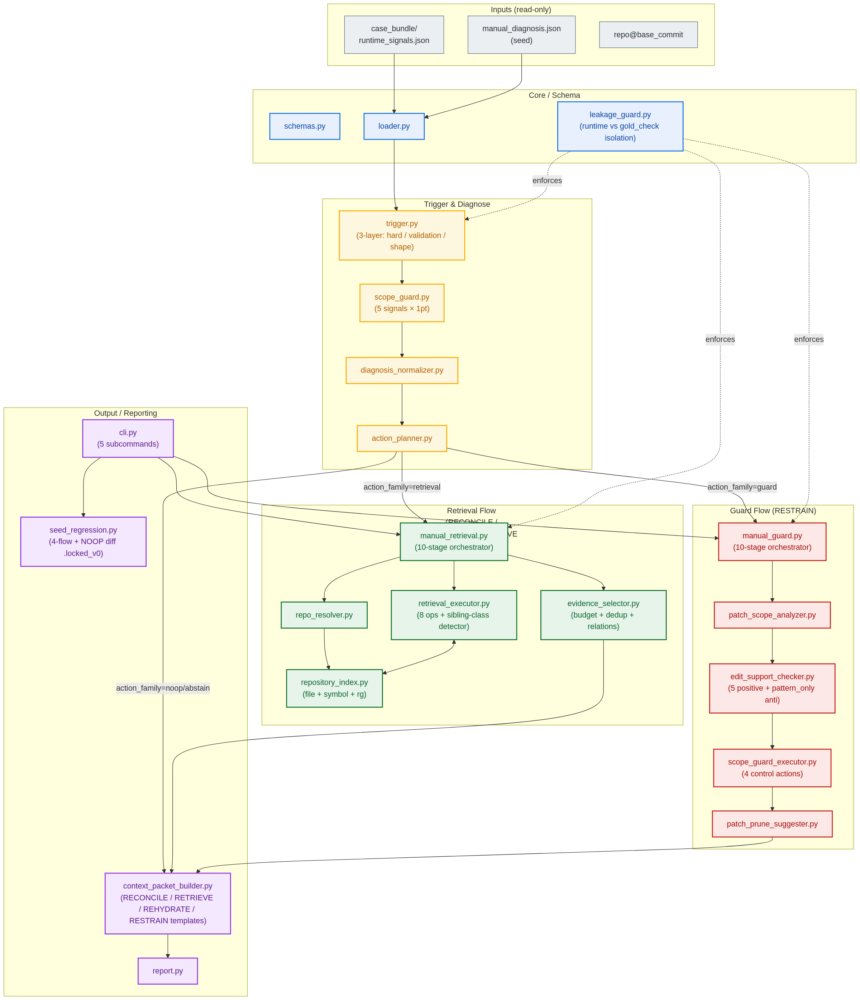
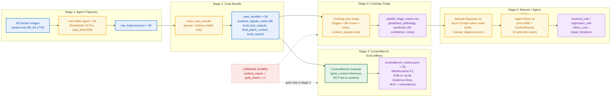

> **文档定位**：本文是一份面向学术导师汇报、兼作论文草稿起点的架构文档，反映 ConDiag 在 2026-06-28 的设计状态，包括 5R 框架、7 类病理 taxonomy、以及已通过 5/5 seed regression 的 v0 Manual Recovery Subsystem。
>
> 配套文档 `ConDiag_研究与实验全流程指导书_v0.1.md` 覆盖**实验流程、工程规范、风险控制**等更细颗粒度内容；本文聚焦**架构与贡献主张**。

\newpage

# 摘要

LLM 编码智能体在仓库级程序修复任务上频繁失败，即便恢复所需信息**已经存在于 trajectory 中**——一个 stack trace 指向了从未被查看的源文件；一段曾经浏览过的代码片段在最终 patch 之前被丢弃；一个 sibling 实现被改了但平行 sibling 漏改。本项目提出 **ConDiag**，一个**与 Host Agent 解耦的失败后上下文恢复中间件**，位于 Host Agent 失败 attempt 与重试 attempt 之间。ConDiag：（一）只从 runtime-visible 信号检测失败模式（**严格不泄漏 gold 信息**）；（二）将失败模式映射到 **5R × 7 类病理 taxonomy**（Relocalize / Retrieve / Rehydrate / Restrain / Reconcile，外加 NO-OP abstain）；（三）对 `repo@base_commit` 执行可执行的 retrieval 或 guard 计划；（四）给重试 agent 输出结构化的 **ContextPacket**，而非杂乱的 chunk 列表。当前 v0 已实现四条 manual-seed recovery flow 外加一条 NO-OP baseline，seed regression 5/5 byte-identical 通过。我们进一步提出 **Pilot50**，一个 50 实例的 ContextBench 评测计划，使用过程级指标（file / block / line F1、Evidence Drop、EditLoc recall）来验证 taxonomy、trigger 阈值与 ContextPacket 机制。

# 1. 问题与研究动机

## 1.1 "朴素重试"的隐性成本

当一个 LLM 编码智能体在仓库级任务上失败时，trajectory 几乎总是已经包含恢复所需的信号：

- 一段 stack trace 明确指出了 agent 从未查看的文件与符号
- 一段曾经浏览过的代码片段恰好包含最终 patch 需要的行
- 一个失败的测试明确点名了 agent 漏掉的 sibling 路径 / 平行 backend
- agent 改对了文件但在提交前**一次本地测试都没跑**

当前主流编码智能体的处理方式无外乎两种：

1. **朴素重试** —— 用相同上下文重新跑一次 agent，期望 LLM 采样到不同的探索路径。成本低，但盲目。
2. **批量检索** —— 不论失败模式如何，预先把整个 repo 的 BM25 / embedding 结果塞给 agent。成本高、噪声大，往往**增加了上下文却不改善利用率**。

二者都未显式完成"**失败信号 → 上下文缺口 → 可执行检索计划 → 具体证据 → 重试包**"这一转换。

## 1.2 Pilot 轨迹揭示的三类失败形态

在 ContextBench-Verified 上对 mini-SWE-agent 做了 5 实例初始 Pilot，浮现出三类反复出现的失败形态，**每一类需要不同的恢复动作**：

| 失败形态 | 示例 | 缺失了什么 |
|---|---|---|
| **错误定位** | sympy-16597 | agent 修改了正确的类，但从未检查 stack trace 中真正的 error origin |
| **看过但被丢弃** | astropy-13398 | agent 看过平行注册位点 `@frame_transform_graph.transform`，但在最终 patch 时没保留 |
| **过度探索、过度修改** | sympy-13877 | 17 个文件改动、4 个重复 pattern、零次测试运行 |

单一的"再多检索一些上下文"无法同时解决这三类——第三类反而需要**更少**的上下文和**修剪** patch。

## 1.3 中间件的空白

缺失的是一种**失败触发的中间件**，它需要满足：（a）与 Host Agent 解耦，可以外接到 mini-SWE、SWE-agent、Agentless、AutoCodeRover 而无需重训；（b）病理感知，不同失败模式触发不同动作；（c）严格 runtime/gold 分离，避免评测 oracle 意外泄漏进 agent 视野。ConDiag 正是为占据这一空白而设计。

# 2. 背景与相关工作

**ContextBench** [1] 提供 1,136 个任务，覆盖 66 个仓库、8 种语言，每个任务都标注了人工验证的 gold context，覆盖**文件 / 定义级 block / 行**三个粒度。关键的是它提供*过程级*指标——Incremental Context F1、Evidence Drop（explored context 与 utilized context 之间的 gap）、EditLoc recall——让我们能测量 *agent 看了什么 vs. 最终用了什么*。SWE-bench Verified [2] 只评测最终 outcome，无法回答这类问题。

**编码智能体**方面，mini-SWE-agent 和 SWE-agent [3] 是交互式 shell agent；Agentless [4] 通过 system-prompt 级联定位，不做 retrieval；AutoCodeRover [5] 在 agent 启动前用 BM25 预检索；RAG 风格 SWE 流水线 [6] 预先把检索 chunk 喂给 agent。**所有这些都是 preemptive 或 trigger-blind 的**；ConDiag 是 **post-failure 且 pathology-aware**。

**过程级诊断**方面，ContextBench 论文的 Evidence Drop 分析 [1] 直接启发了 ConDiag 的 Rehydrate 机制：agent 经常*看到* gold 相关代码，但未在最终 patch context 中保留。

# 3. ConDiag 架构


## 3.1 在管线中的位置

ConDiag 在 Host Agent 的 Attempt 1 以可检测的失败结束后被调用，其输出喂给同一 agent 的 Attempt 2。Host Agent 的 prompt、tools、model 都不动——ConDiag 只控制两次 attempt 之间 agent 收到的*额外上下文*与*重试意图*。这使得中间件与具体 agent 解耦。

## 3.2 5R 框架 × 7 类病理 taxonomy


ConDiag 把每个诊断出的失败映射到五种恢复动作之一：

1. **Relocalize（重新定位）**——重新定位修改目标（stack-trace origin、error token）
2. **Retrieve（补回未见）**——暴露未查看过的上下文（平行实现、邻居测试、sibling 类）
3. **Rehydrate（重激活丢弃）**——重新激活看过但最终 patch 时丢弃的证据
4. **Restrain（收敛过宽）**——收敛过宽的修改（scope guard + patch prune）
5. **Reconcile（协调约束）**——协调目标修复与 regression 约束

另外两类（`LIKELY_CORRECT_NOOP`、`INSUFFICIENT_RUNTIME_EVIDENCE`）触发**abstain**：ConDiag 显式拒绝动作，而不是强行分类。

## 3.3 Oracle → Runtime proxy 映射（*核心贡献*）

Pilot-5 初始分析时曾把 `file_cov`、`symbol_cov`、`EditLoc recall` 当作 trigger 信号。**这些都是 oracle 指标**——计算时需要 gold context，runtime 使用必然泄漏。表 1 展示了我们做的系统性转换，使每条 ConDiag 规则都只依赖 runtime-visible 事实。

**表 1：Oracle → Runtime proxy 映射（节选）**

| Oracle 指标（仅离线） | Runtime-visible 代理（ConDiag 输入） |
|---|---|
| `file_cov < 0.3` | 搜索历史很长但 issue 关键 symbol 定义从未被查看 |
| `symbol_cov = 0` | edited symbol 与 issue / stack / failed-test symbol 完全不重合 |
| `EditLoc recall = 0` | edited spans 远离任何高价值 viewed span |
| `file_precision < 0.2` | edited 文件多，且多数文件缺少独立失败证据 |
| `patch_files > 2×gold_files` | `changed_files ≥ K` + 同一 lexical pattern 跨文件重复 |
| `line_cov 低 + precision 高` | 本地测试仍失败 + 同文件存在未检查 sibling |

**便宜又强的 runtime 信号**（case-bundle 分析得出）：

- `test_runs_count == 0` → OVER_EXPLORE 强信号
- `git_checkout_count ≥ 2` → agent 在 cycling，疑似 REGRESSION
- `viewed_to_edited_ratio > 0.7` → OVER_EXPLORE；`< 0.3` → MISS_CONTEXT
- `repeated_pattern_count ≥ 5` → PATTERN_OVER_GENERALIZATION

Leakage Guard 模块（`leakage_guard.py`）在 case-bundle schema 层强制 runtime/gold 分离。

## 3.4 三层 trigger

ConDiag 的入口 trigger 按顺序分三层：

- **Trigger-0（硬失败）**——timeout、format error、patch 应用失败、空 patch、runtime 异常。ConDiag 直接短路到通用诊断。
- **Trigger-1（runtime-visible 校验失败）**——agent 自跑测试失败，*或* ConDiag 主动跑的 runtime-visible local validation 失败。**主触发**。ConDiag 跑的是"runtime-visible local validation"，**绝不**用 official FAIL_TO_PASS oracle。
- **Trigger-2（patch-shape 异常）**——Scope Guard 得分 ≥ 2（见 §4.2）。**风险触发**，进入 audit / guard 模式，不直接声称 patch 错误。

## 3.5 v0 模块架构



完整模块清单见附录 A。

# 4. v0 实现状态

## 4.1 Manual Recovery Subsystem：5/5 通过


5/5 通过**具体意味着**：

- 给定**人工撰写**的 `manual_diagnosis.json` seed，ConDiag 跑对应的 retrieval 或 guard flow，输出与锁定 baseline 逐字节一致的 ContextPacket。

**不意味着**（我们对此明确划界）：

- **不**证明 *auto-diagnoser* 能自动产出 seed
- **不**证明 Attempt 2 真的能修好任务——那是 Agent-Retry v0（Pilot50 之后里程碑）
- **不**测量相对 gold 的 context-F1——那是 ContextBench 的职责

## 4.2 Scope Guard（RESTRAIN）

Scope Guard 对每个候选 patch 用 5 个二元信号打分：

```
scope_anomaly_score =
    1 if changed_files ≥ 5
  + 1 if changed_lines ≥ 200
  + 1 if api_calls ≥ 80
  + 1 if 检测到 repeated_edit_pattern
  + 1 if 多数 edited 文件缺少 issue / stack / failed tests / viewed evidence 支持
```

得分 ≥ 2 → warning；≥ 3 → strong over-edit。阈值由 Pilot-5 启动，将在 Pilot50 后冻结。

## 4.3 Retrieval Executor

8 个 op，除 `RECONCILE_*` 外都是对 `repo@base_commit` 的可执行 probe：

| Op | 用途 |
|---|---|
| `FIND_SYMBOL_DEFINITION` | 把 short-name hint 解析到 source location |
| `FIND_PARALLEL_IMPLEMENTATIONS` | 跨文件 basename shape 匹配 + 同文件 sibling-class 检测 |
| `FIND_NEIGHBOR_TESTS` | 把 failed-test 概念匹配到邻居测试 |
| `FIND_IMPORTS` | 定位 edited symbol 的 import 位点 |
| `FIND_CALLERS` | 定位 call / decorator 位点 |
| `REHYDRATE_SEEN_EVIDENCE` | 重新接上 viewed spans 但 final patch context 中丢失的部分 |
| `READ_DEPENDENCY_NEIGHBORHOOD` | 在 edited location 周边读取 |
| `FIND_FAILED_TEST` | 检查特定失败测试的源码 |

`RECONCILE_TARGET_FIX_WITH_REGRESSION_CONSTRAINTS` 是 *synthesis* action——它不产出 retrieval 候选，只重构 ContextPacket，让它同时呈现目标修复证据与 regression 约束。

## 4.4 Leakage Guard

每个 case-bundle 与 manual_diagnosis.json 在 schema 层被切两半：

- **runtime_signals**——trajectory / patch / test-log 派生的事实。是 trigger、diagnoser、executor 的**唯一**输入。
- **gold_check**——ContextBench metrics、gold patch shape、oracle pathology label。标记 `allowed_for_runtime: false`。只用于离线分析。

`leakage_guard.py` 拒绝任何 runtime 半部分与 gold 半部分重叠的 case-bundle。

# 5. Pilot50 评测计划



## 5.1 配置

50 个 ContextBench-Verified 实例，来自 500 实例 Lite split，按病理类别分层抽样：

| 分层 | 数量 | 选材理由 |
|---|---:|---|
| Django error-code / system-check / validation | 20 | 挖掘 RELOCALIZE seed（models.E###、SystemCheckError） |
| Django config / database / router / exception | 10 | 定位病理 |
| 非 Django Python（sympy / transformers / astropy / sklearn） | 15 | taxonomy 多样性 |
| 本地 easy / likely-correct 控制样本 | 5 | 测 NO-OP false-positive |

## 5.2 三层分析

1. **Auto triage（全部 50 个）**。跑 ConDiag trigger + 5R scorer + RELOCALIZE miner → 输出 `pilot50_triage_matrix.csv`。回答 4 个问题：ConDiag 会不会乱触发？5R 分流是否合理？NO-OP 是否正确跳过？RELOCALIZE 候选能否被筛出？
2. **Manual diagnosis（top 6-10）**。每个高价值实例撰写 `manual_diagnosis.json`，跑对应 recovery flow。目标：把 4-flow seed 集扩展到 15-20 个 manual recovery fixtures。
3. **Agent-Retry v0（最后）**。挑 10 个最有希望的实例，用 ConDiag ContextPacket 重跑 mini-SWE。对比 Attempt 1 在 resolved / regression / token cost / repair iterations 上的差异。

## 5.3 指标

**主指标（过程级，来自 ContextBench）：**

- 三粒度（file / block / line）的 Incremental Context F1
- Evidence Recovery：ConDiag 检索到的 evidence 命中 Attempt-1 漏掉的 gold
- Evidence Drop Recovery：重新激活的 viewed spans 减少 Evidence Drop
- Retrieved Context Size / Token Cost
- NO-OP False-Positive Rate（在 likely-correct 控制样本上）

**辅助指标（outcome 级，用于 Agent-Retry v0）：**

- Resolved rate（FAIL_TO_PASS / PASS_TO_PASS）
- Regression rate（新破坏的 PASS_TO_PASS）
- Token cost / repair iterations

## 5.4 Evaluation-Only 隔离

ContextBench gold metrics **只**出现在阶段 3（离线评测），物理上无法进入阶段 4（ConDiag runtime triage）或阶段 5（Agent retry）。case-bundle parser（`condiag/tools/build_case_bundle.py`）拒绝把任何 gold 派生字段写入 `runtime_signals.json`。

# 6. 路线图

| 阶段 | 目标 | 状态 |
|---|---|---|
| **P0** | NO-OP Gate（在 success 上不伤害） | ✅ 5/5 seed PASS |
| **P1** | RELOCALIZE seed + flow | ⏳ 待 Pilot50 mining |
| **P2** | REHYDRATE + Scope Guard | ✅ 5/5 seed PASS |
| **P3** | Sibling / Parallel Audit（RETRIEVE） | ✅ 5/5 seed PASS |
| **P4** | REGRESSION_AFTER_PARTIAL_FIX（RECONCILE） | ✅ 5/5 seed PASS |
| **P5** | Auto-diagnoser（替代人工 seed） | Pilot50 之后 |
| **P6** | Agent-Retry 端到端 resolved rate | Pilot50 阶段 5 |

# 7. 竞品对比

**表 2：ConDiag 与相关系统对比**

| 维度 | ConDiag | Agentless | AutoCodeRover | RAG-SWE |
|---|---|---|---|---|
| 触发机制 | 失败后触发 | preemptive | preemptive | preemptive |
| 检索粒度 | 病理感知 | 无 | BM25 chunk | embedding chunk |
| 输出形式 | 结构化 ContextPacket | 定位列表 | bug-location + snippet | chunk 列表 |
| 评测协议 | outcome + process | 仅 outcome | 仅 outcome | 仅 outcome |
| 集成方式 | 解耦中间件 | 独立系统 | 独立系统 | 独立系统 |
| 病理感知 | 5R × 7 类 | 无 | 无 | 无 |

# 8. 开放问题与风险

- **Auto-diagnoser 尚未实现**。当前所有 seed 都是人工撰写。风险是仅靠 runtime 信号分类病理噪声太大。Pilot50 triage matrix 会回答这个问题。
- **RELOCALIZE seed 缺失**。Pilot-5 没出现纯 RELOCALIZE case。如果 Pilot50 也没筛出，5R 框架就有缺口。
- **Recovery execution ≠ repair rate**。通过 seed regression 只证明 ConDiag 能产出目标 ContextPacket。Attempt 2 是否真能修更多任务是 Agent-Retry v0 的问题——目前未实现。
- **规模**。50 实例可能不足以冻结 trigger 阈值。投稿前可能需要扩到 100+。

\newpage

# 附录 A：模块清单

`~/condiag/condiag/` 下 22 个模块，按图 3 分组：

**Core / Schema**：`schemas.py`、`loader.py`、`leakage_guard.py`。

**Trigger & Diagnose**：`trigger.py`、`scope_guard.py`、`diagnosis_normalizer.py`、`action_planner.py`。

**Retrieval flow**：`repo_resolver.py`、`repository_index.py`、`retrieval_executor.py`、`evidence_selector.py`、`manual_retrieval.py`。

**Guard flow**：`patch_scope_analyzer.py`、`edit_support_checker.py`、`scope_guard_executor.py`、`patch_prune_suggester.py`、`manual_guard.py`。

**Output / Reporting**：`context_packet_builder.py`、`report.py`、`cli.py`、`seed_regression.py`。

**Tools（`condiag/tools/` 下）**：`build_case_bundle.py`、`find_relocalize_candidates.py`、`parsers/{base,common,miniswe}.py`。

# 附录 B：5R 动作词汇表

- **Relocalize**：`TRACE_ERROR_ORIGIN`、`FIND_SYMBOL_DEFINITION`、`RERANK_LOCATIONS`。
- **Retrieve**：`FIND_PARALLEL_IMPLEMENTATIONS`、`FIND_NEIGHBOR_TESTS`、`FIND_IMPORTS`、`FIND_CALLERS`、`READ_DEPENDENCY_NEIGHBORHOOD`、`FIND_FAILED_TEST`。
- **Rehydrate**：`REHYDRATE_SEEN_EVIDENCE`。
- **Restrain**：`SCOPE_CONSTRAIN`、`PATCH_PRUNE_CANDIDATES`、`RUN_RUNTIME_VISIBLE_VALIDATION`。
- **Reconcile**：`RECONCILE_TARGET_FIX_WITH_REGRESSION_CONSTRAINTS`。

# 附录 C：参考文献

1. ContextBench: A Process-Level Benchmark for Context Engineering in Repository-Level Program Repair（2026）。
2. SWE-Bench Verified（`princeton-nlp/SWE-Bench_Verified`），500 实例 Lite split。
3. Yang et al., SWE-agent: Agent Computer Interfaces Enable Software Engineering Language Models（2024）。
4. Xia et al., Agentless: Demystifying LLM-based Software Engineering Agents（2024）。
5. Zhang et al., AutoCodeRover: Autonomous Program Improvement（2024）。
6. RAG-SWE retrieval-augmented SWE pipeline variants（various，2024-2025）。
